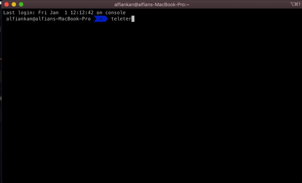

# teleterm
Telegram Bot Exec Terminal Command 
[](https://codecov.io/gh/alfiankan/teleterm)
>you can exec command from your telegram

# Demo

<br>

Video Demo & Tutorial : https://www.youtube.com/watch?v=AJOPngS-BsE

<br>
# Use Case
- Controll Docker CLI 
- Control IoT Devices
- Etc

# Tested On
- [x] ubuntu 20.04
- [x] Mac OS 15


# How To use
    - install `go get github.com/alfiankan/teleterm/teleterm`
    - see following example code

```go
package main

import "github.com/alfiankan/teleterm/teleterm"

func main()  {
	teleterm.StartBot("your telegram bot token")
}

```

# Available Bot Command
| Command       |Desc          |
| ------------- |:-------------:|
|/lock `<true/false>`|Lock/unlock acces to account
| /cmd `<terminal command>`    | exec terminal command and directly get log
| /cmdf `<terminal command>`       | exec terminal command then save log to file
|/get `<file path>`| Download File From server/host
|send File|When you send File directly saved to server or host

# Version History
v1.0
- read telegram token from .env file
- exec command and directly get response log
- exec command then save log to file
- telegram user can receive log text
- sending/uploading file [Document(not included > image, video, and audio)] to server/host device
- Downloading File from server/host device
