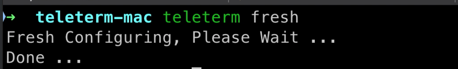
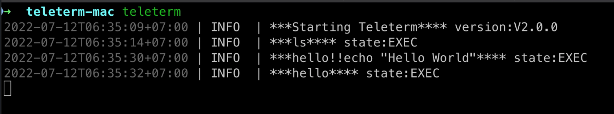
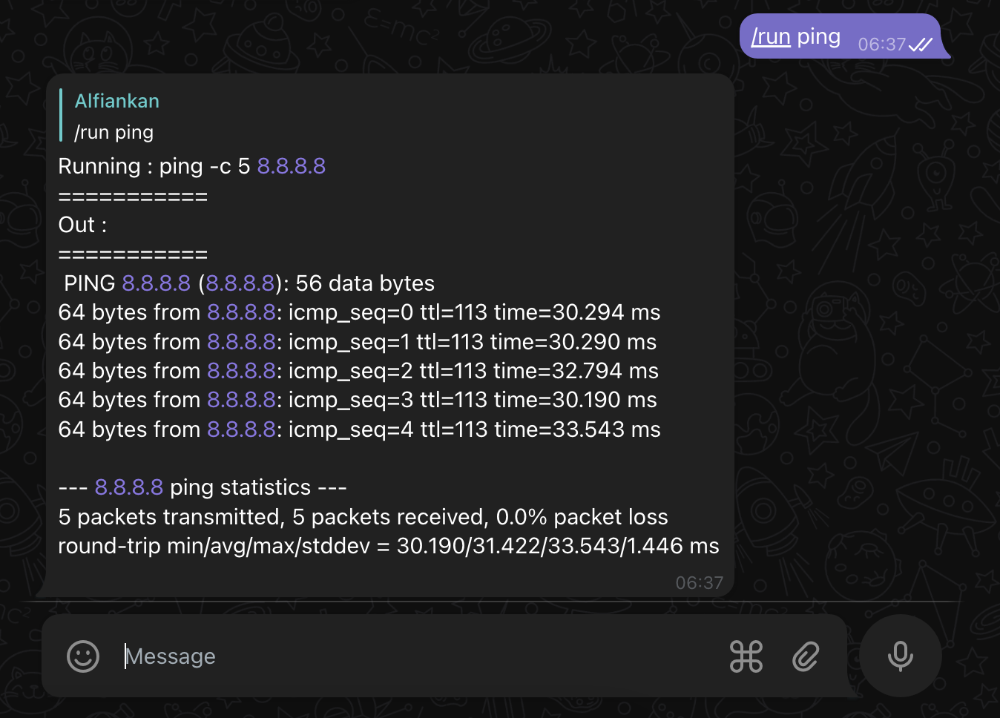
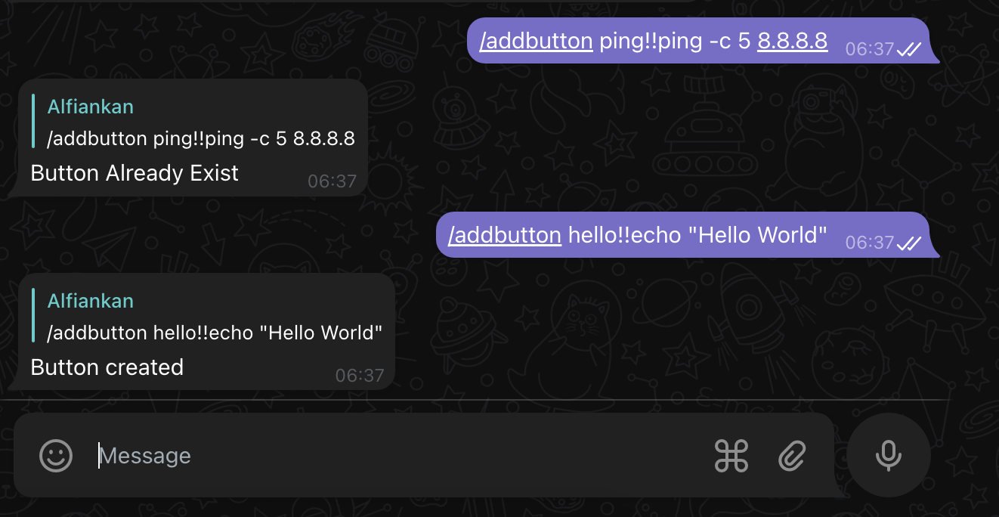
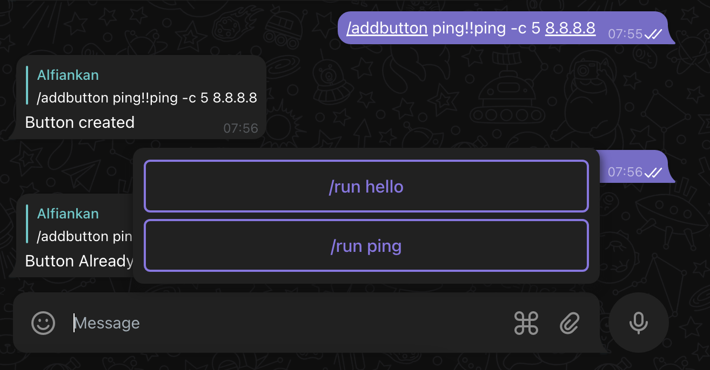
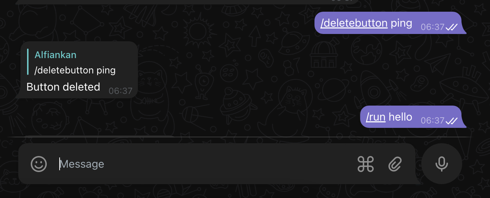
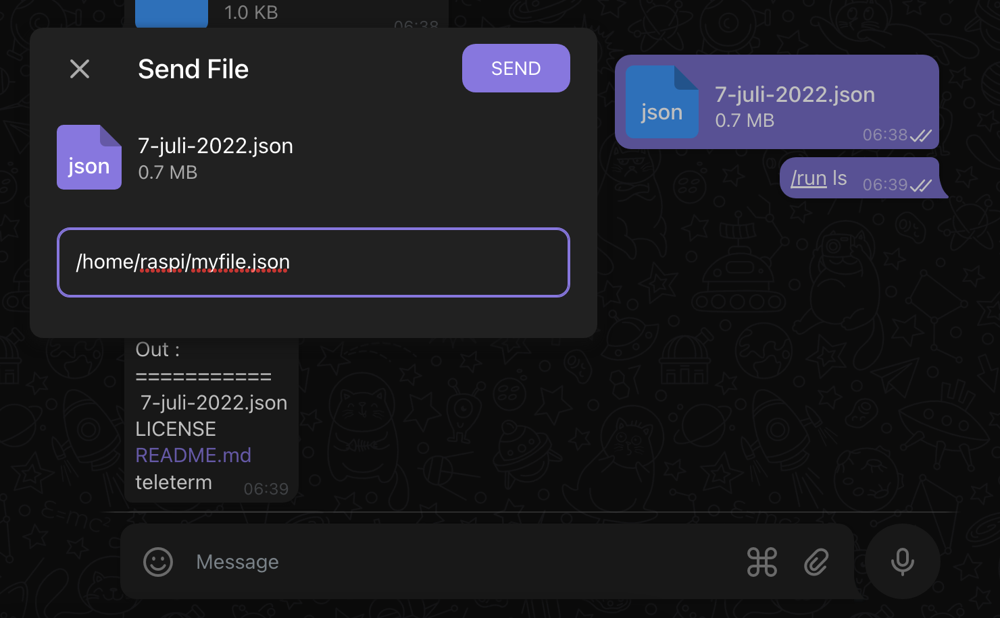
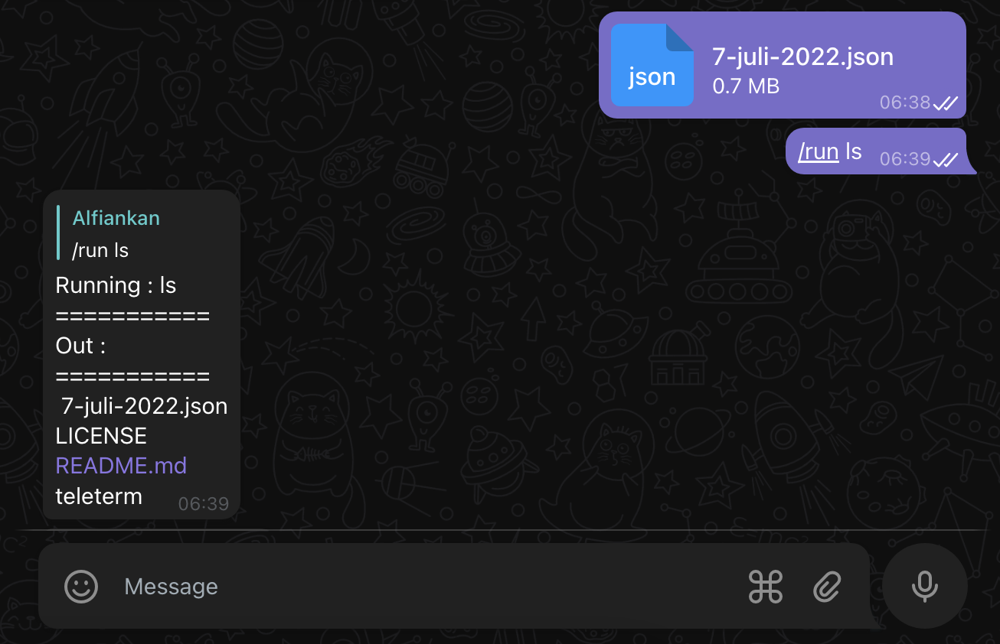
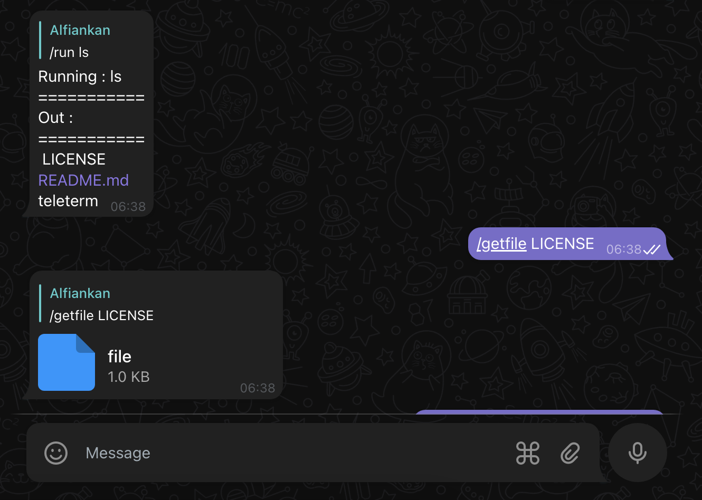

# Teleterm
Telegram Bot Exec Terminal Command 

[](https://codecov.io/gh/alfiankan/teleterm)
[](https://github.com/avelino/awesome-go)  


## Use Case
- Running command on IoT Device through telegram bot
- Transfering Files through telegram bot

## How To Install

1. Prebuilt Binary
	you can download prebuild binary, available prebuilts :

	|os | arch |available |
	| ------------- | ------------- |:-------------:|
	| linux | amd64 | [Download v2.0.0](https://github.com/alfiankan/teleterm/releases/download/v2.0.0/teleterm-linux-amd54.zip) |
	| linux | arm64 | [Download v2.0.0](https://github.com/alfiankan/teleterm/releases/download/v2.0.0/teleterm-linux-arm64.zip) |
	| macos | amd64 | [Download v2.0.0](https://github.com/alfiankan/teleterm/releases/download/v2.0.0/teleterm-mac-amd64.zip) |

	Once the binary is downloaded, you can move the binary to /usr/local/bin

2. Build From Source
	If your arch os is not listed in the prebuilt binary you can build from source.
	
	Required :
	- Go ^1.18
	- gcc

	How to build :
	- clone `git clone https://github.com/alfiankan/teleterm`
	- build `go build -o teleterm-bin ./cmd...`

## How To Run :
Required :
- Telegram bot tokens, to get tokens please refer to [Telegram Docs](https://core.telegram.org/bots#6-botfather)

1. Setting Up Config

	To setup fresh teleterm run 
	
	```bash
	teleterm fresh
	```
	
	

	teleterm will create folder on your home folder with name `.telegram` contains :
	- config.yaml
		config yaml hold teleterm config :

		| Key       |Value          |
		| ------------- |-------------|
		| telegram_token | telegram token from bot father |
		| shell_executor | `/bin/bash` or `/bin/sh` .etc default is `/bin/bash`|

		example config.yaml
		```yaml
			teleterm:
  				telegram_token: "my_tele_token"
  				shell_executor: "/bin/bash"
		```

2. Run teleterm

	To run teleterm simply run `teleterm` and log info will displayed.

	


## Available Bot Command
| Command       |Desc          |
| ------------- |:-------------|
|/refresh |Refresh the bot system
| /run `<command>`| executing command
| /getfile `<filepath>`| transfer donwload file from bot server
|/addbutton `<button_name>!!<command>`| add button shortcut
|/deletebutton `<button_name>`|delete button shortcut


## Run Command
To run command from telegram simply send message using following format :
```bash
/run <command>
```
for example :
```bash
/run ping -c 5 8.8.8.8
```
output replied by telegram bot :



## Add Button Shortcut
To run command from telegram button you need to add buttons simply send message using following format:
```bash
/addbutton <button_name>!!<command>
```
for example :
```bash
/addbutton ping!!ping -c 5 8.8.8.8
```
output replied by telegram bot :



then new button will appeared :



## Shortcut Button
To run command using shortcut simply click the button telegram bot will find the exec command from database.

## Delete Button Shortcut
To delete shortcut button simply send message using following format:
```bash
/deletebutton <button_name>
```
for example :
```bash
/deletebutton ping
```
output replied by telegram bot :



then updated button will appeared.

## Uploading File
To upload file simply send document on telegram:



By default will upload on cwd path if you not add target path on file mention.

output replied by telegram bot :



## Download file
To donwload file simply send message using following format:
```bash
/getfile <filepath>
```

Filepath is filepath on where teleterm running on

for example :
```bash
/getfile /home/raspi/hello.txt
```
output replied by telegram bot :


